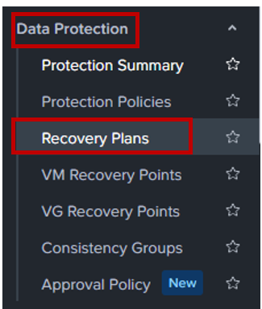
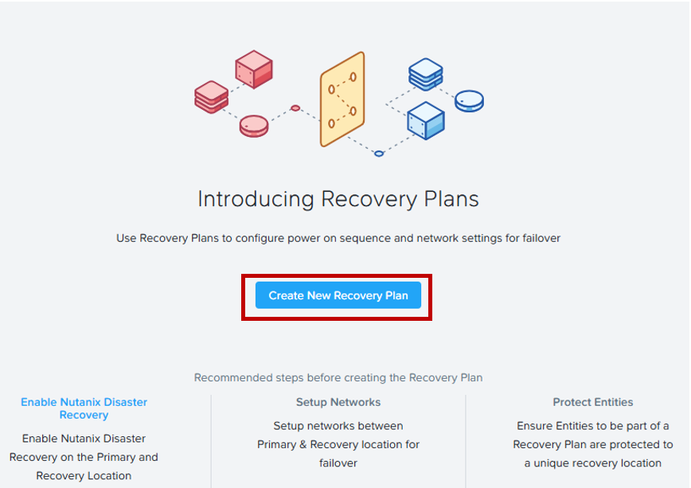
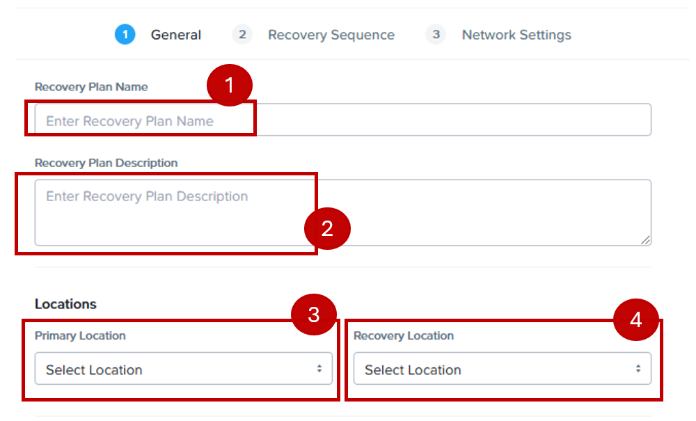
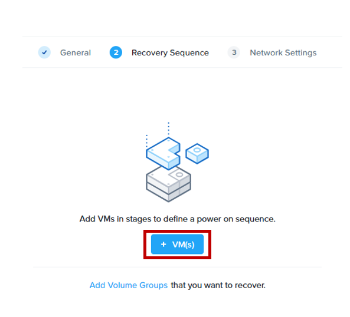
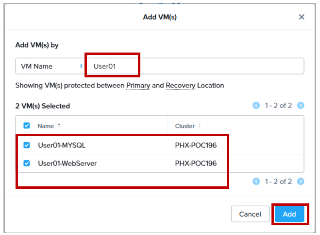
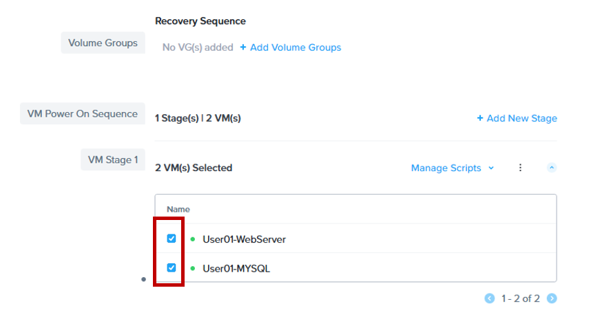
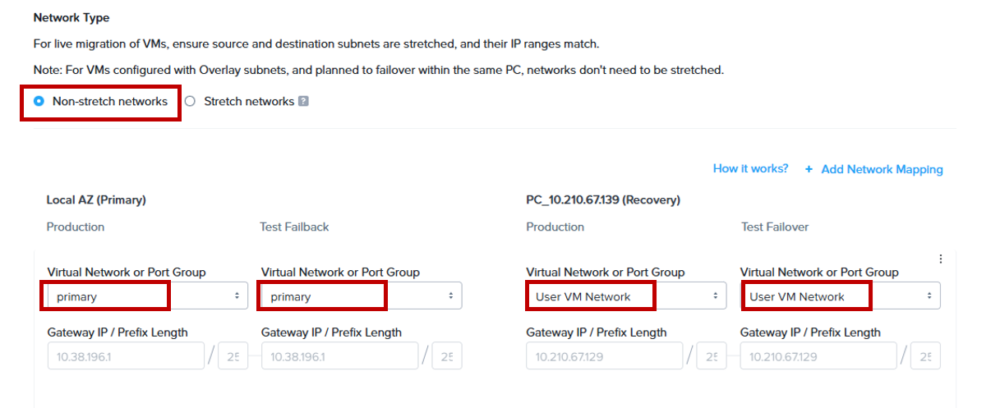

# Recovery Plans

## Creating Recovery Policies

1. Login to your assigned on-prem cluster.

2. Under **Data Protection**, click ***Recovery Plans**.

    

3. Click **Create New Recovery Plan**

    

4. Input the following information:

    - **Recovery Plan Name**: **UserXX-RP** where **XX** is your assigned user number
    - **Recovery Plan Description**: give it a meaningful description
    - **Primary Location**: Local AZ (on-prem cluster)
    - **Recovery Location** Nc2 cluster
    - Click **Next**. (bottom right of the screen)

       

5. Click **+VM(s)**.

    

6. Do the following:
    - **VM Name**: type in your User-XX vm names
    - Cick on the checkbox to select all your VMs
    - Click **Add** to proceed.

       

7. Ensure you check all the boxes next to your VMs. 
   Click **Next** at the bottom right side of your screen.

    

8. Select the following options:
    - **Network Type**: Non-Stretched networks
    - **Local AZ(Primary)**: **primary** for both production and test failback virtual network.
    - **Recovery**: **User VM Network** for both production and test failover virtual network.
    - Click ** Create** at the bottom right side of the screen.

    

9. Login to NC2 Prism Central and you shall see the identical Recovery Plan. 

10. Congratulations! You have successfully created a recovery plan!

11. Let's proceed to the next section to test those plans!

   

   