# Identity and Access management (IAM)

Identity and Access Management (IAM) is an authentication and authorization feature that leverages 
fine-grained Role-Based Access Control (RBAC) along with Authorization Policies. IAM enables users to 
utilize system-defined roles or create custom roles based on granular operations and permissions.

In this section, you will learn how to leverage system roles, assign them to a user, and observe 
their functionality in action.

## Identity and Access Management Fundamentals

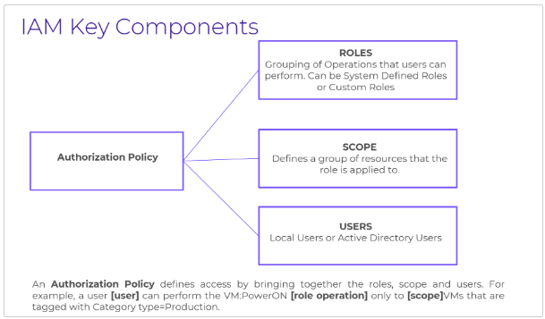

## Overview of the IAM Interface

IAM is managed through the Admin Center of Prism Central.

1. Login to Prism Central using **adminuser##** and the PC password from the Cluster Lookup sheet.

2. Navigate to the App Switcher section in the top left of Prism Central. Click **Admin Center** in the 
App Switcher.

     

3. Click **IAM** in the Admin Center Dashboard.

     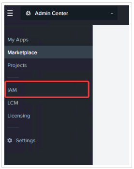

4. In the **Authorization Policies** section, we can see some system-defined policies. System-defined 
   policies were previously referred to as Role Mappings in earlier versions of Prism.

    !!! info
      
        The Prism Admin and Prism Viewer policies can be duplicated (but not edited or deleted), the Super 
        Admin policy cannot be duplicated. However, you can create a new authorization policy that incorporates the Super Admin role.
       
       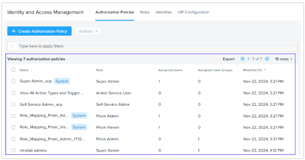

5. The Roles section provides an overview of both built-in and custom roles, including details such as 
   the role name, description, accessible services and entities, and the last updated date.
   System-defined roles can be duplicated or added to an authorization policy but cannot be modified or deleted. The Create Role button allows you to create a new role from scratch.

    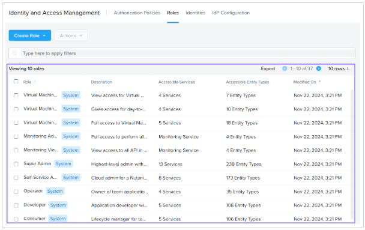

6. The Identities tab gives a view of local users, imported users, and user groups. Imported users are 
users imported from Active Directory, Open LDAP, and SAML Identity Providers.

    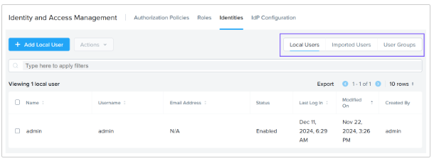

7. The IdP Configuration tab displays the available identity provider (IdP) options. You can add an 
Active Directory, OpenLDAP-based provider, or a SAML identity provider.Additionally, you can configure Common Access Card (CAC) authentication. The Download Metadata option allows you to obtain an XML file that describes Prism Central, which can then be uploaded to the identity provider.

    

## Delegating with Authorization Policies

Consider an IT organization with a IT Operator Role. The IT Operator has limited permissions, allowing 
them to view VMs, power them on, and revert them. These actions are all limited to VMs within a specific 
category called User01:Production. Now, let’s explore how to utilize system-defined roles to manage these 
tasks.

Prism has a rich set of roles that come predefined. e.g: VM Operator, Network Admin, Prism Admin, Prism 
Viewer.

1. Login to Prism Central using adminuser## and the PC password from the Connection Details page.

2. Navigate to the App Switcher section in the top left of Prism Central. Click Admin Center in the App Switcher.

3. Click IAM in the Admin Center Dashboard.

4. Click the Roles Tab.

5. Search for the Role Name: Virtual Machine Operator

    
    
6. Select the Role and Click **Actions**.

7. Select **Add Authorization Policy**.

    
    
8. Click the **Pencil icon** next to **Virtual Machine Operator Policy** and rename it to "Virtual Machine 
    Operator **User##** where **##** is your assigned number. This is a shared cluster, so be sure to rename 
    the policy.
       
    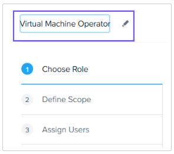
    
9. You can view the list of operations which are allowed for this role.

    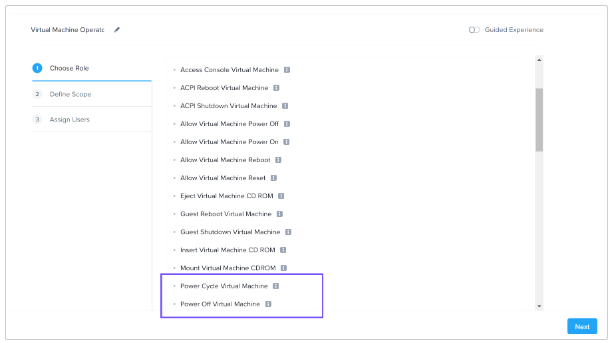

10. Click **Next**, when you are ready to proceed to define the scope.

11. You can choose between Full Access (all entity types and instances) or Configure Access (select 
    specific entity types and instances). Since we are filtering by User##:Production where ## is your 
    assigned number, complete the following steps:

        - Select **Configure Access** : **Select entity types and instances**.
        - Select **All Entity types**
        - Choose **In Category** in Filters field and **Search for the "User##:Production" where ## is 
        your assigned number**.
        - In this example we will search for User01:Production Category

        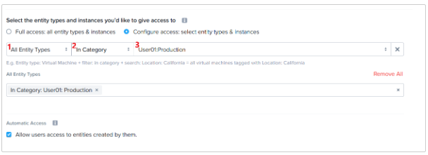
    
12. Click **Next**, when you are ready to proceed to Assign Users

13. Let's Select ntnxlab(AD) and select the AD user operator##@ntnxlab.local.

    
    
14. Click Save. You should see a message "Policy created Successfully" when its successful.

    ## Authorization Policy Verification

    1. Now, let's login to Prism Central as the AD user operator**##**@ntnxlab.local using the PC 
    password from the Connection Details page.

    2. In the Infrastructure Dashboard, Expand Compute & Storage , Click VMs.

        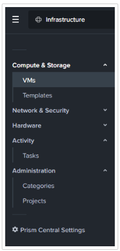
    
    3. The VM's belonging to the Category User**##**:Production will be listed here.

        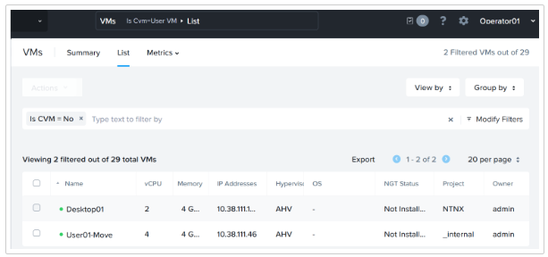
    
    4. Let's select a VM and click **Actions**.

    5. We can see that the user can perform only limited operations such as Update, Power On, and 
    Create Recovery Point.

        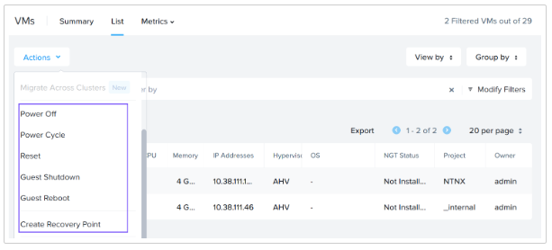
