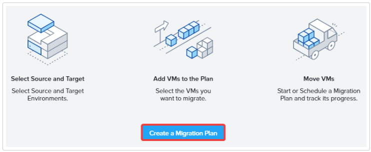
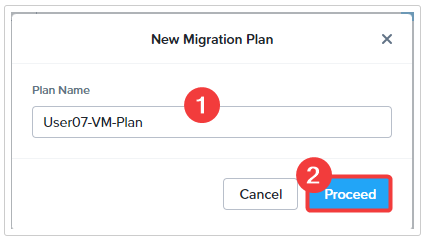
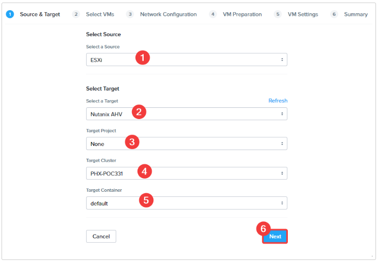
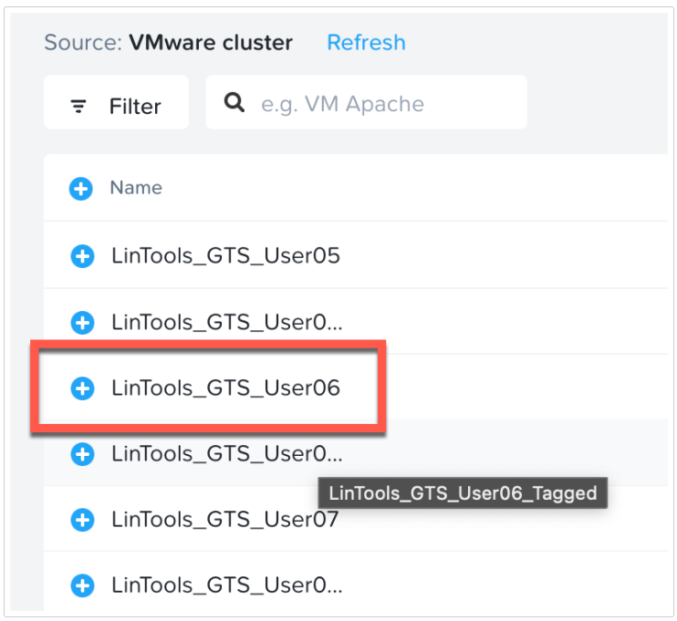
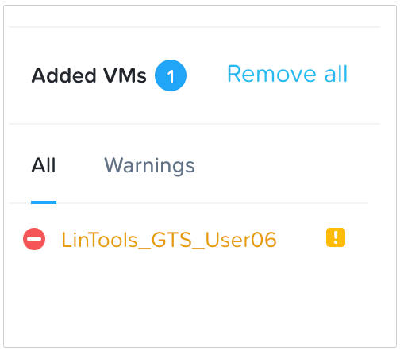
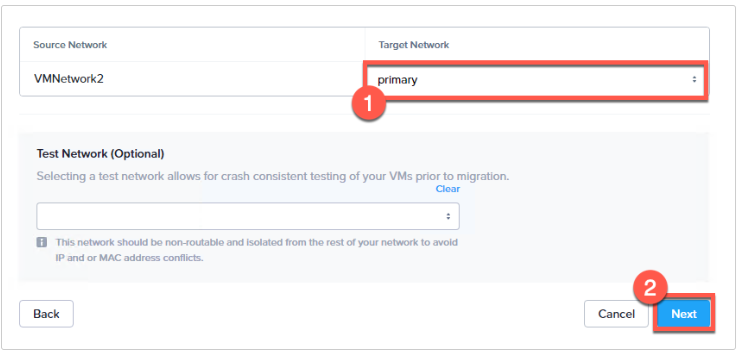
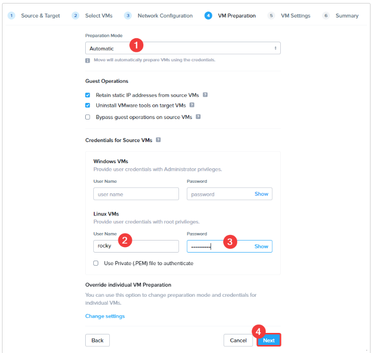
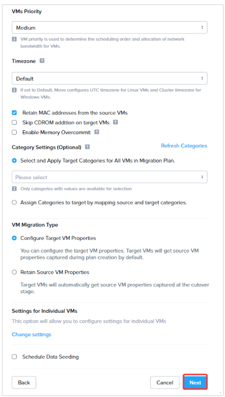
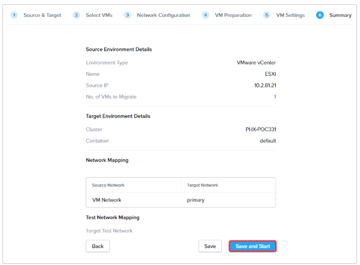

# Create a Migration Plan

Once the source and destination are set up, create the migration plan.

1. Click **Create a Migration Plan**

    !!! note
    
        If **Create a Migration Plan** button is greyed out, wait 2-3 minutes.
    

    

2. Enter a name for the Plan **User##-VM-Plan**. Click **Proceed**.

    

3. Select Source which is ESXi and Target which is Nutanix AHV. Click Next

    - **Select a Source** : ESXi or whatever name you gave above
    - **Select a Target** : Nutanix AHV or whatever name you gave above
    - **Target Project** : None
    - **Target Cluster** : Select the destination AHV cluster
    - **Target Container** : default

        

4. Select your Linux VM to move, **XXX-ECV-User##** where **XXX** is the preface provided to you 
by your instructor. Once selected, click Next in the bottom right-hand corner.

    - There will be two VMs for each student with your student number on them. They have the same name, 
except that one has _Tagged added to the end of the name. **In this migration plan, be sure to use 
the one without tagged in the name.**
    - You may need to use the filter and hover over the VMs to see their full names.

        

    - You can safely ignore the yellow warning icon stating "The VM has a guest OS which 
   is not supported on ESXi", since we are migrating to AHV.

        

5. For Networks, Select **primary** for the Target Network. Click **Next**.

     

6. On the VM preparation page, select the options shown and provide the username and password 
 for the Linux VM.

    - Preparation Mode - Automatic. Manual mode only migrates data over. VM preparation script and 
    all OS configuration options will have to be run manually in manual mode.
    - Guest Operations
      - Retain static IP Addresses from source VMs: If VMs have static IPs, they are retained on the 
      destination. If DHCP is used, like in our case, VMs will get a new IP address on the destination.
      - Uninstall VMware Tools on target VMs: Since we are moving to AHV, we do not need VMWare Tools 
      installed on the VM.
      - Bypass guest operations on source VMs: Will only do data migration and no guest OS operations. 
      Keep this unchecked.
      - Credentials
        - User Name: rocky
        - password: nutanix/4u

            

        !!! note
            
            You only need to enter these credentials into the Linux VMs field and can leave the Windows 
            credentials empty.
        

7. On the VM Settings page, keep the defaults and select **Next**. The fields allow for individual VM 
settings to be modified. This includes settings like enabling Memory Overcommit or applying categories 
that are present in Prism Central.  

       

8. On the **Summary** page, Click **Save and Start**. Selecting **Save** only saves the plan. Save 
and start will save the plan and start the Migration.

    !!! note
       
        If you get a migration error upon saving the plan, wait around 30 seconds and try again.

  
     

