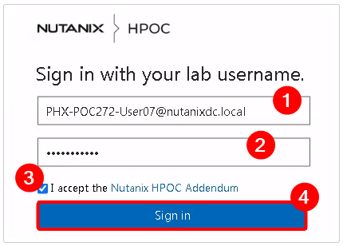

import Tabs from '@theme/TabItem';
import TabsItem from '@theme/TabItem';

Nutanix Move makes it easy to move VMs and workloads onto Nutanix with minimal downtime. 
For this portion of the lab, we'll migrate VMs from ESXi to AHV in NC2 Cluster.

## View Source VM

Let's first take a look at the source VM on ESXi that we will be migrating to Nutanix. We have 
provisioned Linux VMs for every lab user on ESXi that we will use to migrate over to Nutanix.

1. Login to the vCenter from the web browser using the IP address provided. 
**Make sure to use browser tab within your Parallels VDI instance**.

   - vCenter Address - provided by your instructor
   - username - vCenter/vServer login PHX-POC###-User##@nutanixdc.local or DM#-POC###-User##@nutanixdc.local
   - password - vCenter/vServer Password

   

   

   