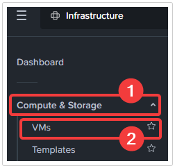
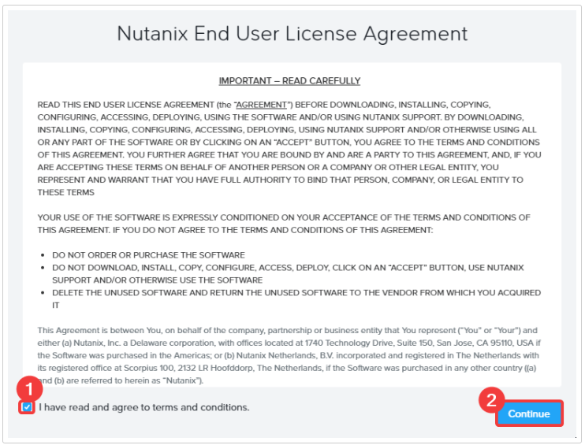
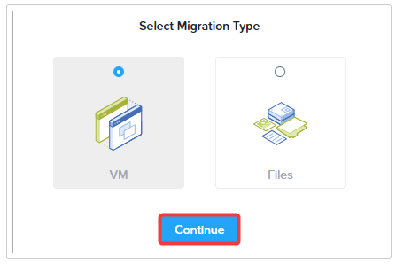
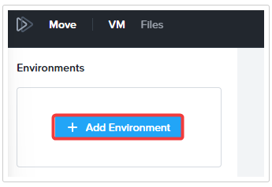
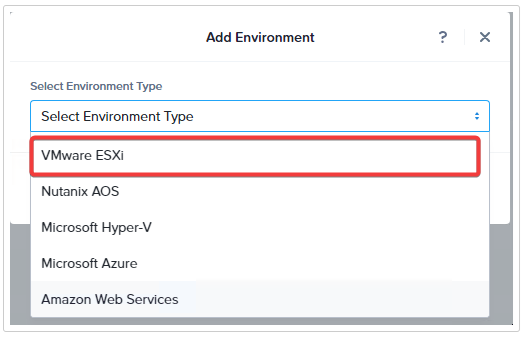
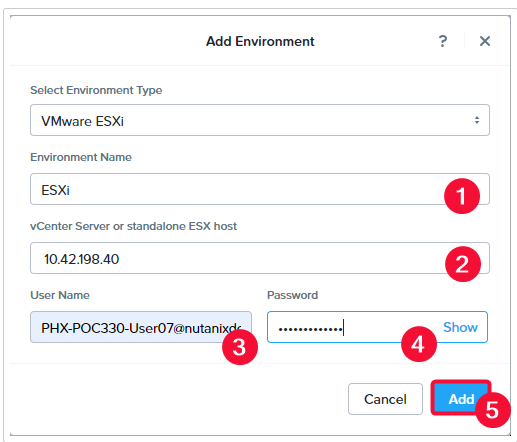
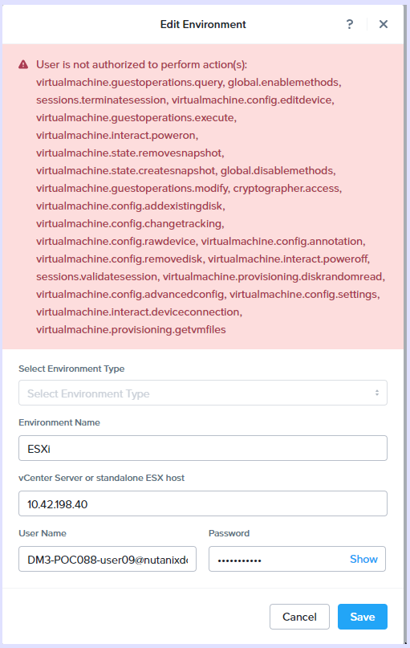
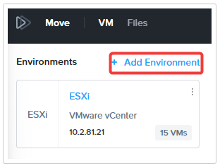
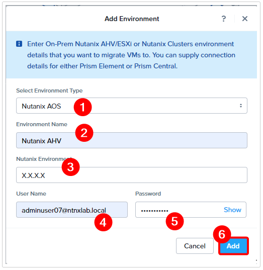

# Setup Nutanix Move

## Setup Move

To migrate, we'll log in to the Move VM and setup the environments and migration plan.

1. Login to Prism Central
     - username - PC login adminuser##@ntnxlab.local or adminuser##
     - password - PC password from Connection Details

2. Navigate to Compute & Storage > VMs
   
     

3. A Move VM known as **Move** has already been created. Look for that VM 
in the main page or you can search in the search bar. Make a note of its IP address.

    !!! Note

            If you are the first person to access the Move VM, follow through steps 4-6 to complete 
            the setup, otherwise please proceed to step 7.

4. Open a new tab in browser within the VDI session and go to that IP address to open Move. 
If it says "Your connection is not private", click **Advanced** and then **Proceed to x.x.x.x (unsafe)**.

5. Accept the Terms and Conditions and click **Continue**. Click **Ok** on the next screen.

    

6. First, it will ask you to set a password. Set **ntnxNc2!** as the password. That way those sharing
the clusters will be able to access them as well.

     

7. Login using the same password which you have set earlier.

     

8. Click **Ok, Got It** on the splash screen.

9. Select Migration Type **VM** and click **Continue**

     

10. We need to add the Source and Destination 
Environments for Move. Let's first add the source ESXi environment. 
**Click Add Environment**

       

11. In Select Environment Type, Select **VMware ESXi**

    

    !!! note

        As you can see, Move supports different environment types including public clouds like
        AWS and Azure

12. Provide the details for the environment. Click **Add**

    - Environment Name : Any Name you like. We suggest Source ESXi.
    - vCenter Server : Provide the IP address: XX.XX.XX.XX
    - username - PHX-POC###-User##@nutanixdc.local or DM#-POC###-User##@nutnaixdc.local. 
    The username is case sensitive
    - password - vCenter password
    
           

    !!! note
        If you get an error about user not authorized, make sure the username is correct. 
        The username is case sensitive and also uses the @nutanixdc.local domain.

        

13. Once the ESXi environment is validated and added, next lets add our 
destination Nutanix AHV cluster. Click **Add Environment**

    

14. In Select Environment Type, Select Nutanix AOS and then provide the details 
for the environment. Click **Add**. 
**Remember this is the copy of PC residing in NC2**.

    - Environment Name : Any Name you like. We suggest Target AHV.
    - Nutanix Environment : Provide the IP address of PC
    - username - PC login - adminuser##@ntnxlab.local
   password - PC password

      

15. Now repeat **steps 13 to 14** to add in NC2 environment as another destination. 

16. Now is a good time to pause for a minute while the Prism Central is added 
to the Move instance and it retrieves the inventory.

17. After a short pause you can proceed to the basic migration in **"Migrating 
VMs with Move"** with the link below.
